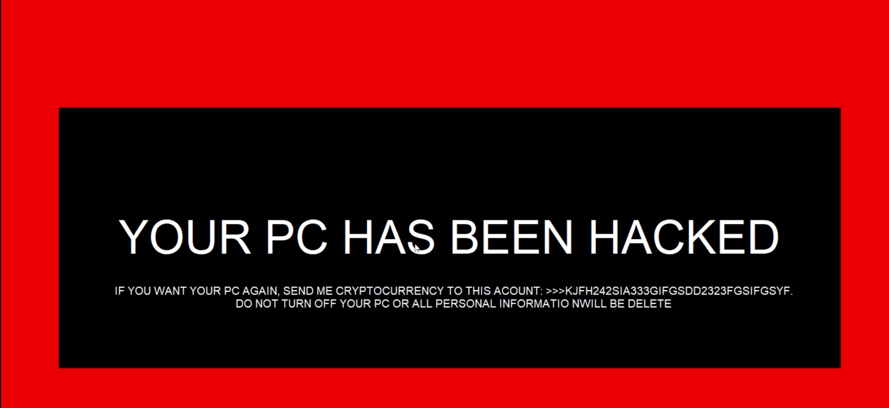

# locked machine

## Descripción

El funcionamiento y la lógica de este programa son sencillos. Lo que hace es bloquear todas las teclas del teclado para que la persona que lo ejecuta crea que se ha roto el ordenador. 
En realidad, no es un programa malicioso; lo hice por diversión y para aprender un poco de lógica de programación. Sin embargo, es importante tener cuidado, ya que si se ejecuta el programa, no se podrá salir de él a menos que se apague el ordenador, otra opcion para terminar el programa es dando click en un recuadro diminuto que esta ubicado en la parte inferior izquerda de la letra S en la palabra HAS, son 2 segundos para terminar la ejecucion del programa.

En el código, agregué un widget que, cuando se ejecuta el programa, no es visible. Es un botón que, si se oprime, cierra la pantalla del ordenador y desbloquea la tecla Windows.
Si logra oprimirlo, puede salir del programa en un lapso de tiempo mínimo antes de que se vuelva a abrir la pantalla del programa.

Este programa lo hice con fines educativos, y no me hago responsable de cualquier daño.

The operation and logic of this program is simple, what it does is block all the keys on the keyboard so that the person who runs it believes that the computer 
has broken, in reality it is not a malicious program, I did this for fun and learn a little programming logic, in the same way it is important to be careful since 
if you run the program you will not be able to exit it unless you turn off the computer.

In the code add a widget that cannot be seen when the program is run, it is a button that if pressed closes the computer screen and the Windows key is unlocked, 
if you manage to press it you can exit the program in a minimum period of time before before the program screen reopens.

I did this program with educational fines and I am not responsible for any damage.

## Instalación

Para tener el archivo ejecutable se debe clonar el repositorio y con pyinstaller se empaqueta.

